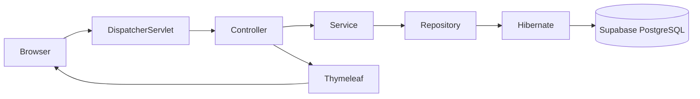
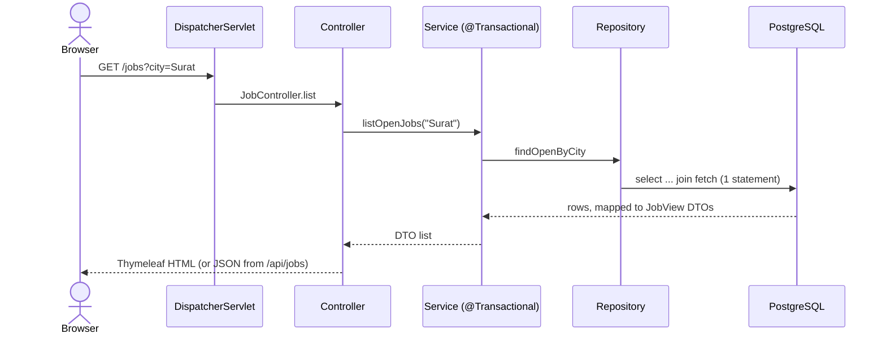

# placement-portal-springmvc-hibernate

Campus Placement Portal: a complete CRUD teaching application for the PPSU expert session
(**Spring MVC + Hibernate / Spring Data JPA + Flyway + Supabase PostgreSQL**, Thymeleaf pages and a JSON endpoint).
Companies post jobs, students apply, an admin tracks application status.



## Quick start (5 steps)

1. **Prerequisites**: JDK 21, Git, an IDE. Check with `prerequisites/check-prereqs.ps1` (Windows) or `.sh`. Details: [prerequisites/README.md](prerequisites/README.md)
2. **Clone**: `git clone https://github.com/<you>/placement-portal-springmvc-hibernate.git && cd placement-portal-springmvc-hibernate`
3. **Choose a database**
   * No account: use the `local` profile (in-memory H2, same Flyway scripts).
   * Supabase (works the same in IntelliJ, VS Code and the terminal): run `create schema if not exists app;` in the Supabase SQL Editor,
     copy `config/supabase.properties.example` to **`config/supabase.properties`** (git-ignored) and fill in `supabase.password`
     (plain text, no URL encoding). On an IPv4-only network use the Session pooler host and user, as explained in that file.
     The app reads it by itself in every IDE and in `start.cmd` / `start.sh`.
   * IDE launchers are included: IntelliJ run configs *PlacementPortal Supabase* and *PlacementPortal local H2* (`.run/`),
     VS Code launch entries in `.vscode/launch.json`. Just press Run.
4. **Run** the one-click way: it builds if needed, starts the app, waits for `/actuator/health` and checks the main pages.
   ```bash
   start.cmd             # Windows, Supabase      (start.cmd local = H2, start.cmd demo = N+1 demo, stop.cmd = stop)
   ./start.sh            # macOS / Linux / Git Bash (./start.sh local, ./stop.sh)
   ```
   Or run it yourself:
   ```bash
   ./mvnw spring-boot:run -Dspring-boot.run.profiles=local     # H2
   ./mvnw spring-boot:run                                       # Supabase
   ```
   (Windows: `mvnw.cmd`, and quote the argument in PowerShell: `"-Dspring-boot.run.profiles=local"`)
5. **Open** http://localhost:8080

## Supabase database scripts (`database/`)

| File | When | What |
| --- | --- | --- |
| `01_create_schema.sql` | **once, required** | `create schema if not exists app;` then start the app: Flyway creates tables and seed data |
| `02_verify.sql` | after the first start | row counts 5/12/8/20, Flyway history, sample join |
| `03_reset.sql` | before a rehearsal | drops and recreates schema `app` (destructive, only that schema) |
| `04_manual_full_schema_and_seed.sql` | optional | the whole database by hand; then start the app with Flyway off (`--spring.flyway.enabled=false`, see the script header); run `03_reset.sql` to return to the normal Flyway way |

## What you can do

| Area | Pages |
| --- | --- |
| Jobs | `/jobs` open postings + city filter, `/jobs/{id}`, `/jobs/manage` (paged), add / edit / delete |
| Companies | `/companies` list, add, edit, delete (blocked while postings exist) |
| Students | `/students` list, add, edit, delete (blocked while applications exist) |
| Applications | `/applications` (add `?slow=true` for the N+1 version), apply `/jobs/{id}/apply`, shortlist, bulk shortlist, change status (optimistic lock), withdraw |
| JSON | `/api/jobs`, `/api/jobs/{id}`, `/api/jobs/summaries` |
| Ops | `/actuator/health` |

## Read the Hibernate SQL log and the N+1 demo

SQL logging and statistics are on. Run with `--demo.n-plus-one=true` and compare the two **Session Metrics** blocks:

| Variant | JDBC statements |
| --- | --- |
| `listSlow()` lazy proxies | **26** |
| `listFast()` JOIN FETCH | **1** |
| `listSlow()` with profile `batch` (`default_batch_fetch_size`) | **4** |

`./mvnw spring-boot:run -Dspring-boot.run.profiles=local -Dspring-boot.run.arguments=--demo.n-plus-one=true`

## Tests

`./mvnw verify` runs 52 tests on H2 (no secrets, no Supabase). See [docs/04-test-cases-and-key-features.md](docs/04-test-cases-and-key-features.md).

## How a request flows (one picture)



Animated version for the session: open [docs/flow-explorer.html](docs/flow-explorer.html) in any browser (offline, no install). Four flows: startup, read, apply (POST + redirect), N+1.

In the running app, open **Architecture Demo** (`/demo`): the three-part ORM / Spring MVC / Gen AI walkthrough, the flow explorer, and links to every Claude artifact. See [docs/12-interactive-walkthrough.md](docs/12-interactive-walkthrough.md).

## Documentation (tasks 1 to 9)

| Task | Where |
| --- | --- |
| 1 Code | `src/main/java/com/ppsu/placement/{company,job,student,application,common}`, `src/main/resources`, `demos/` |
| 2 Database design | [docs/01-database-design.md](docs/01-database-design.md), `db/migration/V1..V3` |
| 3 ORM changes | [docs/02-orm-changes.md](docs/02-orm-changes.md) |
| 4 Prerequisites | [prerequisites/](prerequisites/README.md) |
| 5 Architecture and flow diagrams | [docs/03-architecture-and-flows.md](docs/03-architecture-and-flows.md) |
| 6 Test cases, key features | [docs/04-test-cases-and-key-features.md](docs/04-test-cases-and-key-features.md) |
| 7 How to present each piece | [docs/05-session-highlight-guide.md](docs/05-session-highlight-guide.md) |
| 8 Live session script, step by step | [docs/06-live-session-demo-script.md](docs/06-live-session-demo-script.md) |
| 9 Slide deck content (PPT ready) | [docs/07-ppt-slide-deck-content.md](docs/07-ppt-slide-deck-content.md) |
| 10 Runnable session examples (appendix at `/examples`) | [docs/09-session-examples.md](docs/09-session-examples.md) |
| Animated flow for the session | [docs/flow-explorer.html](docs/flow-explorer.html) |

## Project layout

```text
demos/                       three single-file Java demos (java Demo1Annotations.java)
docs/                        design, ORM, diagrams, tests, session guide, live script, slide content, flow-explorer.html
prerequisites/               versions, install and check scripts
src/main/java/com/ppsu/placement/
  company/ job/ student/ application/   entity, repository, service, controller, forms, views
  common/                    exception handlers, exceptions, home, dashboard
src/main/resources/          application*.properties, db/migration, templates, static
src/test/java/...            repository, service, MockMvc and query-count tests
```

## Git tags (catch-up points)

`step-0-skeleton`, `step-1-entities`, `step-2-repositories`, `step-3-mvc-pages`, `step-4-validation`, `step-5-transactions`, `step-6-performance`, `final`; how to cut them is in docs/05, section 6.

## Challenge

Add a city filter to the job list without extra queries. A reference solution is already in the code (`findOpenByCity`); for the session, remove it and let students rebuild it.

## Troubleshooting

| Symptom | Likely cause | Fix |
| --- | --- | --- |
| `Unable to determine Dialect without JDBC metadata` | no connection | read the real cause higher in the log, usually `password authentication failed` |
| Unknown host / network unreachable | direct connection on an IPv4-only network | use the Session pooler string |
| `FATAL: Tenant or user not found` | user must be `postgres.<project-ref>` | copy the string from Connect again |
| `prepared statement ... does not exist` | Transaction pooler (6543) | switch to Session pooler (5432) |
| SSL / handshake errors | missing `sslmode` | add `sslmode=require` |
| Authentication fails with special characters | password not percent-encoded | encode it or reset it to letters and digits |
| `missing table [application]` on H2 | H2 identifier case | keep `DATABASE_TO_LOWER=TRUE` in the H2 URL |
| Port 8080 in use | old run alive | stop it or `--server.port=8081` |

**Security:** never commit the real connection string (`config/supabase.properties` is git-ignored); reset the Supabase password after a public session.
