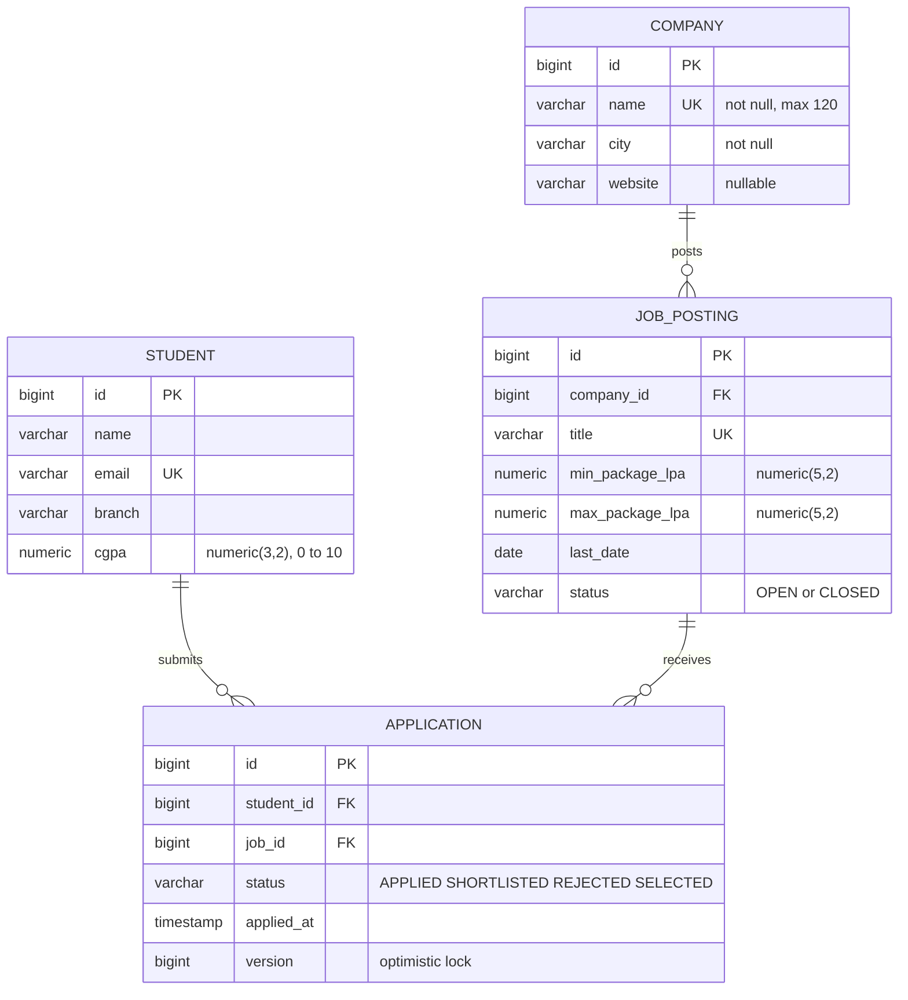

# Task 2: Database Design

PostgreSQL (Supabase) in schema `app`; the same SQL also runs on H2 (PostgreSQL mode) for the `local` profile and tests.
Flyway owns the schema (`src/main/resources/db/migration`); Hibernate only validates it (`ddl-auto=validate`).

## 1. Entity-relationship diagram

`APPLICATION` is an association entity: Student and JobPosting are many-to-many, and the link carries its own data (status, time, version), so it is a table and an entity of its own, not a `@ManyToMany`.

## 2. Tables, constraints and why

| Table | Constraint | Purpose |
| --- | --- | --- |
| company | `name` unique | no duplicate companies |
| job_posting | FK `company_id`; `title` unique; `ck_job_status`; `ck_job_package (max >= min)` | integrity enforced even if the app is bypassed |
| student | `email` unique; `ck_student_cgpa (0..10)` | login-style identity; sane marks |
| application | FK student and job; `uq_application (student_id, job_id)`; `ck_app_status`; `version` | the **real** guard against double applications when two requests race |

Indexes: `idx_job_company`, `idx_app_student`, `idx_app_job` (one per foreign key, because PostgreSQL does not index FKs automatically) and `idx_job_status_last_date` (V3, serves `where status='OPEN' order by last_date`).

## 3. Migrations

| File | Content |
| --- | --- |
| `V1__init.sql` | four tables, constraints, FK indexes |
| `V2__seed_data.sql` | 5 companies, 12 postings, 8 students, 20 applications (no explicit ids, joins by natural keys) |
| `V3__perf_index.sql` | composite index for the open-jobs query (L6) |

Rules: never edit an applied migration; add `V4__...` instead. Keep SQL portable (plain types, no PostgreSQL-only features) so H2 accepts it.

## 4. Why the seed is fixed

Every posting and every student appears in at least one application, so the N+1 demo is deterministic:
`1 (list) + 8 (students) + 12 (jobs) + 5 (companies) = 26` statements, and `1` after the fix. `QueryCountTest` asserts both numbers.

## 5. Delete rules (no cascade on purpose)

| Delete | Rule | Reason |
| --- | --- | --- |
| Company with postings | blocked, message shown | would orphan postings |
| Job with applications | blocked, "close it instead" | history must survive |
| Student with applications | blocked | same |
| Application | allowed (withdraw) | leaf record |

The FK constraints would also reject these deletes; the service checks first to give a friendly message (and the `GlobalExceptionHandler` maps any `DataIntegrityViolationException` to a 409 page as the safety net).

## 6. Supabase specifics

* Tables live in schema **`app`**, not `public` (Supabase exposes `public` through its Data API).
* Create it once: `create schema if not exists app;`
* Use the **Session pooler** (port 5432) JDBC string with `sslmode=require`; not the Transaction pooler (6543).
* Check after first start: `select count(*) from app.application;` returns 20; `app.flyway_schema_history` lists V1 to V3.
