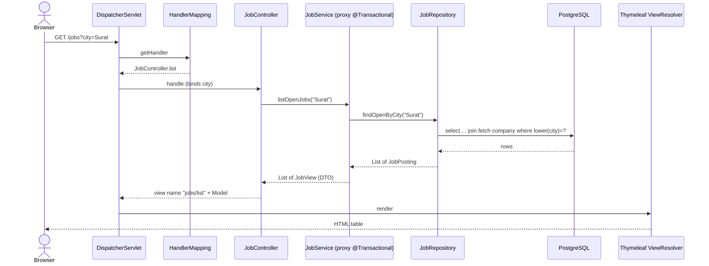
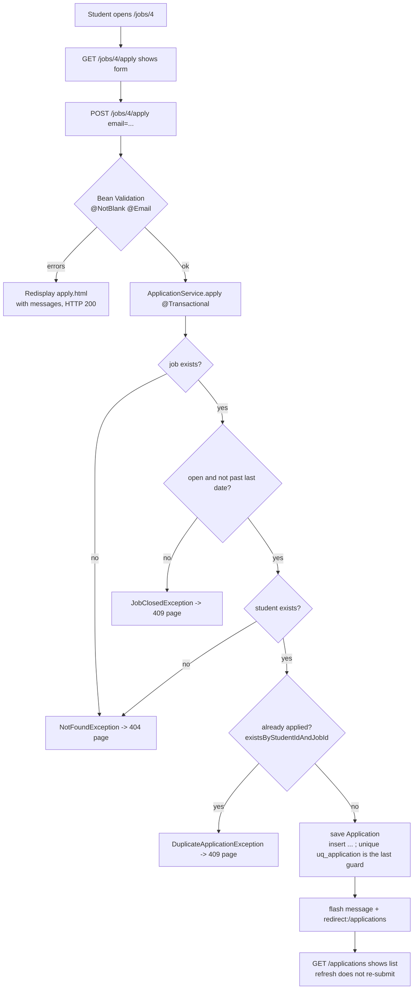
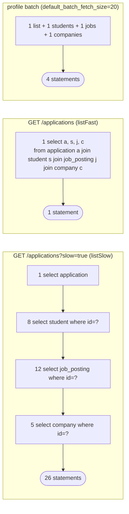
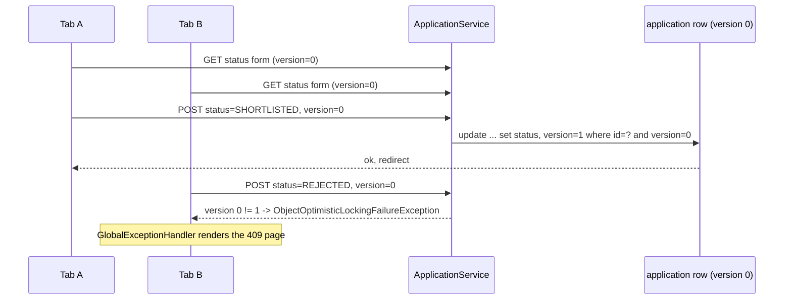
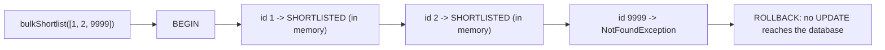
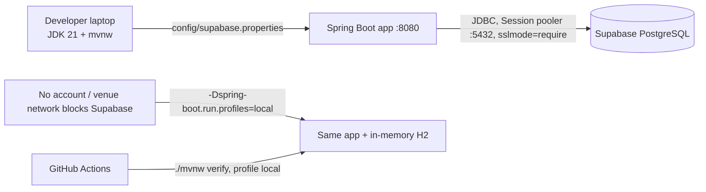

# Task 5: Architecture and Flow Diagrams (with example flows)

Diagrams are Mermaid: they render on GitHub and in IntelliJ / VS Code (Markdown preview with Mermaid support).

## 1. Layered architecture

```mermaid
flowchart TB
    B[Browser / curl]
    subgraph Web["Web layer (Spring MVC)"]
        DS[DispatcherServlet<br/>front controller]
        C1[JobController<br/>CompanyController<br/>StudentController<br/>ApplicationController]
        C2[JobApiController<br/>@RestController, JSON]
        EH[GlobalExceptionHandler<br/>ApiExceptionHandler]
        V[Thymeleaf templates]
    end
    subgraph Svc["Service layer (@Transactional)"]
        S[JobService / CompanyService<br/>StudentService / ApplicationService]
        D[DTOs: JobView, ApplicationRow, Forms]
    end
    subgraph Data["Data layer"]
        R[Spring Data JPA repositories]
        H[Hibernate ORM / JPA]
        E[Entities: Company, JobPosting,<br/>Student, Application]
    end
    F[Flyway migrations V1 V2 V3]
    DB[(Supabase PostgreSQL<br/>schema app)]
    H2[(H2 in-memory<br/>local profile)]

    B --> DS --> C1 --> S
    DS --> C2 --> S
    S --> R --> H --> E
    H -->|JDBC| DB
    H -.->|local profile| H2
    F --> DB
    C1 --> V --> B
    C2 -->|JSON| B
    EH -.-> DS
```

Package-by-feature layout: `company/ job/ student/ application/ common/`; each feature has entity, repository, service, controller, forms and views together.

## 2. Request lifecycle (Demo 6)



Key sentence: *the browser never talks to your controller; it talks to DispatcherServlet.*

## 3. Example flow A: apply for a job (POST, Post-Redirect-Get, validation, rules)



Concrete run (H2 or Supabase): `POST /jobs/4/apply email=yash@ppsu.example` -> `302 /applications`; same request again -> `409 "This student has already applied to this job posting."`; `/jobs/2/apply` (QA Automation Trainee, CLOSED) -> `409 closed`; `/jobs/9999` -> `404`.

## 4. Example flow B: the N+1 demo (Demo 4)



## 5. Example flow C: stale form and optimistic locking (L5)



## 6. Example flow D: all-or-nothing bulk shortlist (transaction rollback)



## 7. Environment / deployment view


