# Task 8: Live Session Script, Step by Step

How to explain the flow of the application *dynamically*: one story, told in the order the data actually moves, with a command, a click and a thing to point at in every step.
Companion files: [flow-explorer.html](flow-explorer.html) (animated flow, open it in a browser, works offline), [07-ppt-slide-deck-content.md](07-ppt-slide-deck-content.md) (slide text), [05-session-highlight-guide.md](05-session-highlight-guide.md) (file by file notes).

**Setup before students join (10 minutes before)**

| Do | Command / action |
| --- | --- |
| Reset data | run `database/03_reset.sql` then `database/01_create_schema.sql` in Supabase SQL Editor (or use the `local` profile) |
| Start | `start.cmd` (Windows) or `./start.sh`; fallback `start.cmd local` |
| Windows to arrange | browser at `localhost:8080`, IDE with the log console visible, Supabase Table Editor (schema `app`), `docs/flow-explorer.html` in a second tab |
| Console | clear it, increase font; the SQL lines are the show |

The golden rule of the session: **every click in the browser must be answered by a line in the console.** Say the click, point at the SQL.

---

## The story in one picture

```mermaid
flowchart LR
    S1["1 Start<br/>Flyway + validate"] --> S2["2 Read<br/>GET /jobs"]
    S2 --> S3["3 Same service<br/>JSON /api/jobs"]
    S3 --> S4["4 Write<br/>apply (POST + PRG)"]
    S4 --> S5["5 Guards<br/>400 / 404 / 409"]
    S5 --> S6["6 Dirty checking<br/>shortlist"]
    S6 --> S7["7 Rollback<br/>bulk shortlist"]
    S7 --> S8["8 Locking<br/>two tabs"]
    S8 --> S9["9 N+1<br/>26 to 1 to 4"]
    S9 --> S10["10 Recap<br/>one request, all layers"]
```



Total about 60 minutes of live material; steps 7 and 8 are optional if time is short.

---

## Step 1. Application starts (3 min): schema as code

**Say:** "Before any page exists, two things happen: Flyway builds the database, Hibernate checks that my entities match it."

| Action | What the audience sees |
| --- | --- |
| Run `start.cmd` | console: `Migrating schema "app" to version 1 - init`, `2 - seed data`, `3 - perf index`, then `Started PlacementPortalApplication` |
| Show Supabase Table Editor | tables `company`, `job_posting`, `student`, `application`, `flyway_schema_history` |
| Open `/` | dashboard counts **5 / 12 / 8 / 20** |

**Point at:** `ddl-auto=validate` in `application.properties`. "If I rename a column in an entity and restart, the app refuses to start. Mapping and schema cannot drift."
**Dynamic touch:** open the flow explorer, flow 0 (startup), and click through: JDBC connect, Flyway, Hibernate validate, Tomcat ready.

## Step 2. Read flow: GET /jobs (6 min)

**Say:** "The browser never talks to my controller. It talks to the DispatcherServlet."

| Action | Console / screen |
| --- | --- |
| Open `/jobs` | 11 open postings (the CLOSED QA job is missing) |
| Open `/jobs?city=Surat` | 3 postings; console shows **one** `select ... join company ... where lower(city)=?` |
| Breakpoint in `JobController.list` (optional) | step over: `JobService.listOpenJobs` -> `JobRepository.findOpenByCity` |

**Walk the layers (flow explorer, flow 1):** Browser -> DispatcherServlet -> HandlerMapping -> `JobController` -> `JobService` (transactional proxy) -> `JobRepository` -> Hibernate -> PostgreSQL -> rows -> `JobView` DTO -> Thymeleaf -> HTML.
**Point at:** `join fetch` in the SQL ("one query, company comes with the job"); the template only receives DTOs.

## Step 3. Same service, two outputs (3 min)

Open `/api/jobs` next to `/jobs`. **Say:** "`@Controller` returns a view name, `@RestController` returns data. Same `JobService`, same SQL."
Then `/api/jobs/9999` (JSON problem, 404) and `/jobs/9999` (friendly page, 404). "Same exception, two renderings: `GlobalExceptionHandler` vs `ApiExceptionHandler`."

## Step 4. Write flow: apply for a job (8 min)

1. Open `/jobs`, pick *Data Analyst Intern*, click **Apply**.
2. Submit with an **empty email**: form redisplays with "Email is required" (HTTP 200, Bean Validation, no service call).
3. Submit `yash@ppsu.example`: redirect to `/applications` with a flash message; console shows `insert into application ...`.
4. Press **F5** on the list: nothing is re-submitted. **Say:** "Post-Redirect-Get: the POST answered with a 302, the refresh repeats a GET."

**Point at:** `ApplicationController.apply` (`@Valid`, `BindingResult`, `redirect:`) and the order of guards in `ApplicationService.apply`: job exists, job open, student exists, not already applied, then `save`. "Friendly message first, database constraint last."

## Step 5. Guards and error pages (4 min)

| Try | Result | Why |
| --- | --- | --- |
| apply `yash@ppsu.example` again | 409 "already applied" | `existsByStudentIdAndJobId`, backed by `uq_application` |
| apply to *QA Automation Trainee* | 409 "closed" | status CLOSED |
| apply `nobody@ppsu.example` | 404 | student not found |
| `/jobs/9999` | 404 page, no stack trace | exception handler |
| delete company *Nimbus Tech* | blocked, has postings | rule in the service, not the controller |

## Step 6. Dirty checking (3 min)

On `/applications` click **Shortlist** on a row. Console: `update application set status=?, version=? where id=? and version=?`.
**Ask:** "Which line saved it?" Open `ApplicationService.shortlist`: there is no `save()`. "Inside a transaction, Hibernate compares the managed entity with its snapshot at commit time."

## Step 7. Rollback (optional, 3 min)

```bash
curl -X POST localhost:8080/applications/bulk-shortlist -d "ids=1&ids=2&ids=9999"
```
Result: 404, and rows 1 and 2 are unchanged. **Say:** "Two updates were prepared, the third id failed, the transaction rolled back. No UPDATE reached the database."

## Step 8. Optimistic locking (optional, 4 min)

Open **Change status** for the same row in two tabs. Save tab A (works, `version` 0 -> 1). Save tab B: **409**. "B edited stale data. The `@Version` column made the second UPDATE match zero rows."

## Step 9. The N+1 moment (8 min): the one students remember

1. **Poll first:** "12 jobs, 8 students, 20 applications. How many SQL statements to list all applications?"
2. Open `/applications?slow=true`, count the `select` lines aloud: **26** (1 + 8 students + 12 jobs + 5 companies).
3. Open `/applications`: **1** (`join fetch`).
4. Optional: `start.cmd demo` prints both **Session Metrics** blocks; profile `batch` gives **4**.
5. Bonus: remove `@Transactional` from `listSlow` and re-run: `LazyInitializationException`. Link back to the proxy demo.

**Say:** "Nothing is wrong with the code; lazy loading is doing exactly what it was told. The fix is to ask for what you need in one query."

## Step 10. Recap: trace one request end to end (3 min)

Use flow explorer, flow 2 (apply) with all layers lit, and ask the audience to name each layer before it highlights. Finish with the five takeaways:

1. Annotations are data Hibernate reads by reflection.
2. `@Transactional` is a proxy that begins and commits.
3. Lazy loading plus a loop equals N+1; measure it, then fix it.
4. DTOs and forms, never entities, cross the web boundary.
5. Rules belong in the service; the database constraint is the last guard.

---

## Backup moves (90-second rule)

| Problem | Move |
| --- | --- |
| Supabase unreachable | `start.cmd local`, say "same code, local database" |
| Port 8080 busy | `--server.port=8081` |
| Query count is not 26 | check `open-in-view=false`; reset schema |
| Compile error on stage | `git checkout <tag> -- <path>` |

## Timing options

| Slot | Plan |
| --- | --- |
| 45 min | steps 1, 2, 4, 5, 6, 9, 10 |
| 60 min | all except 7 |
| 90 min | everything plus the city-filter challenge from the README |
