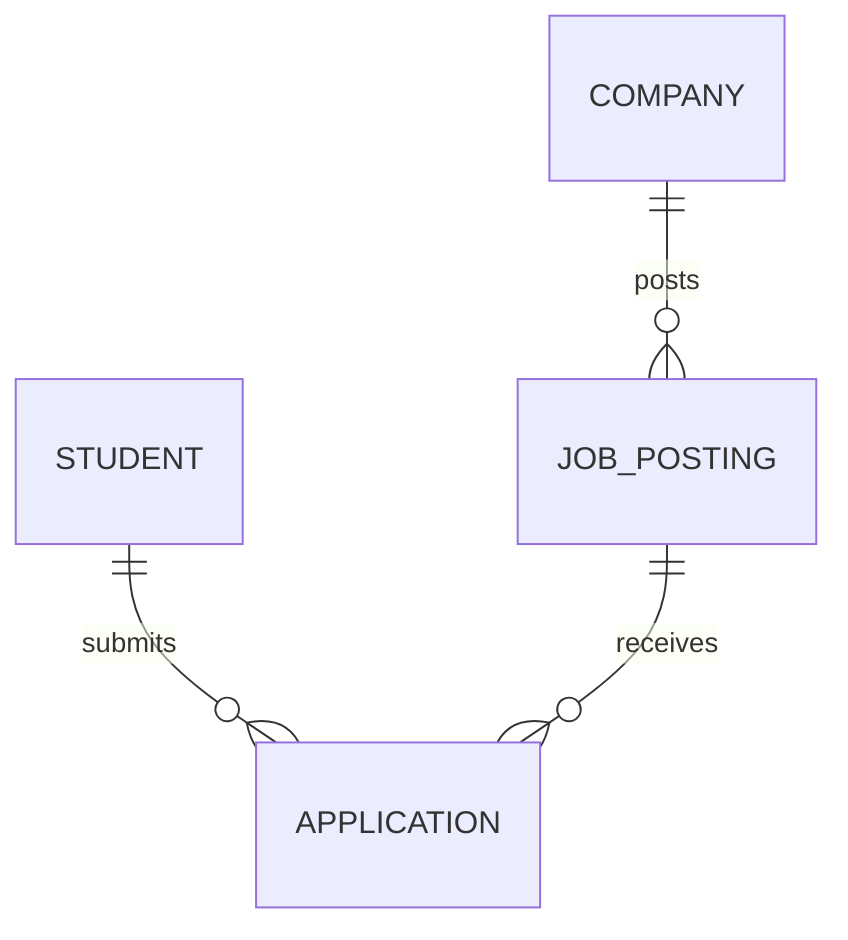
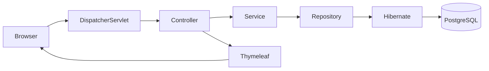
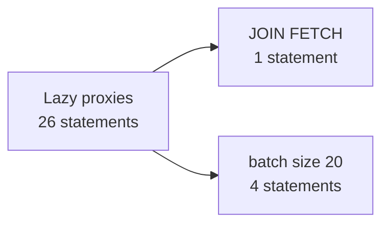

# Task 9: Slide Deck Content (PPT ready)

Paste slide by slide into PowerPoint / Google Slides, or hand this file to Claude ("make a .pptx from docs/07-ppt-slide-deck-content.md") for a ready deck.
Each slide has: **Title**, **On the slide** (keep it this short), **Visual**, **Say** (speaker notes), **Live** (what to show in the app).
Mermaid diagrams: paste into https://mermaid.live and export PNG/SVG, or screenshot from [flow-explorer.html](flow-explorer.html).
Theme suggestion: white background, one accent color (PPSU blue), code in a monospace font, max 6 lines of text per slide.

---

## Slide 1. Title
**On the slide:** Spring MVC + Hibernate in Practice: a Campus Placement Portal. PPSU expert session. Your name, date.
**Visual:** PPSU logo (`src/main/resources/static/img/ppsu-logo.png`), app screenshot of `/jobs`.
**Say:** "Today we do not read slides about frameworks. We follow one click from the browser to the database and back."

## Slide 2. What we are building
**On the slide:** Companies post jobs. Students apply. Admin tracks status. 4 tables, 12 jobs, 8 students, 20 applications.
**Visual:** ER diagram.

**Say:** "Application is its own table because the link carries data: status, time, version."
**Live:** Supabase Table Editor, schema `app`.

## Slide 3. The stack in one line
**On the slide:** Browser > Spring MVC > Service > Spring Data JPA > Hibernate > PostgreSQL (Supabase). Flyway builds the schema. Thymeleaf renders pages.
**Visual:** layered architecture diagram.

**Say:** "Six hops. Today you will see every one of them happen."

## Slide 4. Step 1: the app starts
**On the slide:** Flyway applies V1 schema, V2 seed, V3 index. Hibernate `validate` checks entities against tables. Mismatch = app does not start.
**Visual:** console screenshot of the Flyway lines.
**Say:** "The database is code, versioned in Git. Hibernate only verifies, it never changes the schema."
**Live:** `start.cmd`, then the dashboard 5 / 12 / 8 / 20.

## Slide 5. Step 2: a read request
**On the slide:** `GET /jobs?city=Surat` goes: DispatcherServlet > HandlerMapping > JobController > JobService > JobRepository > SQL > JobView > Thymeleaf.
**Visual:** request lifecycle sequence diagram (docs/03, section 2).
**Say:** "The browser never talks to your controller. It talks to DispatcherServlet."
**Live:** `/jobs?city=Surat`, point at the single `select ... join fetch`.

## Slide 6. One service, two outputs
**On the slide:** `@Controller` returns a view name. `@RestController` returns JSON. Same `JobService`, same SQL.
**Visual:** side-by-side screenshots of `/jobs` and `/api/jobs`.
**Say:** "Business logic is written once. Only the last step differs."

## Slide 7. Step 3: a write request
**On the slide:** Validate > check rules > insert > redirect. Post-Redirect-Get: refresh never double-submits.
**Visual:** apply-flow flowchart (docs/03, section 3).
**Say:** "Four guards in order: job exists, job open, student exists, not already applied. The unique constraint is the last line of defence when two requests race."
**Live:** empty email, valid apply, F5, second apply gives 409.

## Slide 8. Errors the user can read
**On the slide:** 400 validation message, 404 not found, 409 conflict. HTML page for browsers, JSON for APIs. Never a stack trace.
**Visual:** table of the 5 failing requests (script, step 5).
**Say:** "One exception type, two renderings."
**Live:** `/jobs/9999` and `/api/jobs/9999`.

## Slide 9. Transactions and dirty checking
**On the slide:** `@Transactional` = a proxy that begins and commits. Inside it, changing a managed entity is enough: no `save()`.
**Visual:** code snippet.
```java
@Transactional
public void shortlist(Long id) {
    Application a = applications.findById(id).orElseThrow();
    a.setStatus(ApplicationStatus.SHORTLISTED);   // no save()
}
```
**Say:** "Which line saved it? None. Hibernate compared the entity with its snapshot at commit."
**Live:** click Shortlist, show the `update ... where id=? and version=?`.

## Slide 10. All or nothing, and stale forms
**On the slide:** Bulk shortlist `[1, 2, 9999]` rolls back everything. Two tabs editing one row: second save gets 409 (`@Version`).
**Visual:** rollback flowchart + optimistic lock sequence diagram (docs/03, sections 5 and 6).
**Say:** "Transactions protect consistency inside one request; versions protect it between two humans."

## Slide 11. The N+1 problem (predict first)
**On the slide:** 12 jobs, 8 students, 20 applications. How many SQL statements to list all applications?
**Visual:** poll, then the diagram below.
**Say:** "Vote now: 1, 5, 26 or 100?"


**Live:** `/applications?slow=true` (count the lines), then `/applications`.

## Slide 12. Why 26?
**On the slide:** 1 list + 8 students + 12 jobs + 5 companies. LAZY is the right default; looping over it is the bug. Fix: ask for everything in one query.
**Visual:** query breakdown (docs/03, section 4).
**Say:** "Nothing is broken. Lazy loading did exactly what it was told. Measure first, then pick the lightest fix."

## Slide 13. Performance toolbox
**On the slide:** JOIN FETCH, `@EntityGraph`, projection (two columns), paging, batch fetch size, index on `(status, last_date)`.
**Visual:** table: symptom, tool, where in the repo.
**Say:** "Be honest: 12 rows will use a sequential scan; the index is for the habit."

## Slide 14. Safety net: tests
**On the slide:** 38 automated tests on H2, no secrets needed. They assert 26 and 1 as numbers.
**Visual:** table of 6 test classes (docs/04).
**Say:** "A performance fix without a test comes back."
**Live:** `./mvnw verify` (green).

## Slide 15. What real projects add
**On the slide:** Spring Security, caching, Docker, messaging, observability, CI/CD.
**Visual:** icons row.
**Say:** "You learned the core. These sit on top of exactly the same layers."

## Slide 16. Five takeaways
**On the slide:**
1. Annotations are data Hibernate reads by reflection.
2. `@Transactional` is a proxy.
3. Lazy + loop = N+1: measure, then fix.
4. DTOs cross the web boundary, entities do not.
5. Rules in the service; the constraint is the last guard.

## Slide 17. Challenge and interview questions
**On the slide:** Challenge: city filter with one query. Interview: `get()` vs `load()`; what is N+1; `merge()` vs `persist()`; why `mappedBy`; first vs second level cache; why `open-in-view=false`; `@Controller` vs `@RestController`; where does `@Transactional` belong.
**Say:** "If you can explain these with today's demos, you can explain them in an interview."

## Slide 18. Links
**On the slide:** GitHub repo, README quick start, `docs/`, contact.

---

## Prompt to generate the deck with Claude

> Using docs/07-ppt-slide-deck-content.md, create an 18-slide PowerPoint. Use the PPSU logo, one blue accent, monospace code blocks, render each mermaid diagram as a picture, put the "Say" text in speaker notes and the "Live" text in a small footer tag on the slide.
